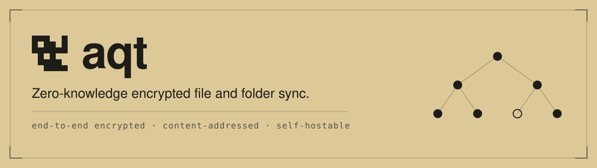

<picture>
  <source media="(prefers-color-scheme: dark)" srcset="docs/assets/banner-dark.svg">
  
</picture>

[](https://github.com/Aquitano/aqt-sync/actions/workflows/linux.yml)
[](https://github.com/Aquitano/aqt-sync/actions/workflows/windows.yml)
[](https://github.com/Aquitano/aqt-sync/releases)
[](LICENSE)

aqt syncs files and folders between your machines through a server you run yourself.
Your files are encrypted on your machine before they are uploaded, and the server never
sees a key, a filename, or a plaintext byte. What it does hold is ciphertext plus the
operational metadata it needs to route requests and enforce policy, and none of that
identifies your content.

Encryption is XChaCha20-Poly1305. Argon2id turns your passphrase into an unlock key that
wraps a random root key, and the root key never leaves the machine. Folders sync
incrementally: unchanged chunks are not re-sent, and a file that appears in several of
your folders is stored once. If you would rather not reveal even the shape of a folder,
it can go up as a single sealed pack instead.

The server is one static Go binary (`aqt-server`) and a SQLite data directory. Nothing in
that directory identifies your content, so you can back it up somewhere you do not
control.

See [docs/architecture.md](docs/architecture.md) for the design and an index of every
specification document, [docs/threat-model.md](docs/threat-model.md) for what the
server can and cannot see, and [docs/protocol/](docs/protocol/) for the wire formats.

## Install

macOS and Linux:

```
curl -fsSL https://web.sync.aquitano.me/install.sh | sh
```

Windows (PowerShell):

```
iwr -useb https://web.sync.aquitano.me/install.ps1 | iex
```

Both scripts read the release's signed update manifest to learn which archive belongs to
your platform, check the download against the size and SHA-256 the manifest declares, and
install to `~/.local/bin` (`%LOCALAPPDATA%\Programs\aqt` on Windows). `--server` also
installs `aqt-server`, and `AQT_INSTALL_DIR` picks a different location. Add
`--version=vX.Y.Z` to pin a release.

The install script trusts whatever the origin serves, because verifying an Ed25519
signature from a shell script is not practical. Later updates do not rely on that trust:
`aqt update` checks the manifest signature against keys compiled into the binary. To
verify the first install too, download from the [releases
page](https://github.com/Aquitano/aqt-sync/releases) and check the build provenance:

```
gh attestation verify aqt_<version>_<os>_<arch>.tar.gz --repo Aquitano/aqt-sync
```

### From source

Requires Go (see `go.mod` for the version). Pure Go, so no CGO and no system libraries.

```
make build          # builds ./bin/aqt and ./bin/aqt-server (+ the git-remote-aqt link)
make test           # go test ./...
make restore-drill  # full backup -> restore -> byte-diff proof (see below)
```

A build from source calls itself `dev`, and `aqt update` reports that rather than
replacing it: there is no release a `dev` build can safely compare itself against. Use a
release build if you want self-updates.

## Client quickstart

```
# Point at a server and create an account (or attach a new device to an existing one).
aqt --server https://aqt.example.com login --email you@example.com

# Push a single file, privately (default) or as a public link.
aqt push secret.env
aqt push notes.md --public

# Most commands take a unique name, an id, or a tracked path.
aqt info secret.env
aqt mv secret.env production.env
aqt share production.env --expire 24h
aqt ls -l --filter env --sort date

# Track a folder and sync it two-way, like git.
aqt init ~/vault
aqt sync ~/vault

# Merge non-overlapping text edits; overlaps/binary/delete-modify cases preserve
# the remote version as <name>.conflict-<host>-<timestamp>.
aqt sync ~/vault --conflicts=merge

# Review local edits as a unified diff, or inspect incoming changes only.
aqt diff ~/vault
aqt diff --remote ~/vault

# Restore a tracked folder on another machine after `aqt login` there.
aqt clone <folder-id> ~/vault

# Bind an existing local directory to a remote folder, reusing matching files by
# hash instead of re-downloading; one-sided differences surface as conflicts.
aqt clone --adopt <folder-id> ~/vault

# Store Git history as an encrypted remote instead of syncing live .git files.
aqt repo create vault-history
git remote add origin aqt::vault-history
git push -u origin main
```

`aqt <path>` with no subcommand is shorthand for `aqt push <path>`. Run `aqt --help` for
the full command set (`ls`, `find`, `cat`, `share`, `unshare`, `shares`, `contacts`,
`snapshot`, `checkpoint`, `restore`, `watch`, `devices`, `passphrase`, and more).

`aqt checkpoint <name>` saves a named, anchored snapshot that retention never prunes, and
`aqt restore <name>` brings it back (side-by-side by default, or `--in-place` to roll the
live tracked folder back). The name is sealed on this machine like any other snapshot
label. To anchor or unanchor a snapshot you already have, use `aqt snapshot anchor <id>`
and `aqt snapshot unanchor <id>`.

To grant a resource read-only to another account, use `aqt share <id> --with <email>`.
The recipient sees it under `aqt shares` and can pull or clone it, and you can never
modify their copy. `aqt contacts` lists the accounts pinned on first use for `--with`
sharing: `aqt contacts verify <email>` compares fingerprints out-of-band, and
`aqt contacts rm <email>` drops a pin so the next share re-pins.

`aqt account delete` erases the account and every byte stored under it, and asks for your
passphrase rather than trusting the device token alone. There is no undo: the server holds
no keys, so nobody can bring it back for you.

## TUI

`aqt tui` opens a lazygit-style dashboard for the tracked folder you are in. It shows
local and incoming changes (kept live by file events), snapshots and checkpoints, and
every resource you have pushed.

Keys act on whichever panel has focus: `s` syncs and `c` checkpoints in the files panel,
`d` diffs a snapshot against the live tree and `R` restores it, `y` copies a resource ref
and `s` shares one with expiry or burn options. `?` always lists the keys for wherever you
are.

Every action runs the matching `aqt` command and streams its output into a log pane, so
anything the TUI can do is reproducible at the shell. Outside a tracked folder, the
resources and snapshots panels still work account-wide.

## Self-hosting the server

```
# Local / development: plain HTTP on :8080.
AQT_DATA_DIR=./aqt-data ./bin/aqt-server

# Production: terminate TLS natively or behind a reverse proxy.
AQT_DATA_DIR=/var/lib/aqt-server AQT_ADDR=:443 \
  AQT_TLS_CERT=/etc/aqt/fullchain.pem AQT_TLS_KEY=/etc/aqt/privkey.pem \
  ./bin/aqt-server
```

The client refuses to send its bearer token over plain HTTP to any non-loopback host, so
an offsite server has to serve HTTPS. `http://localhost:8080` is exempt for local
development.

`GET /livez` is the liveness probe, and `GET /readyz` admits traffic only while storage is
available and the server is not shutting down. `/healthz` remains a liveness compatibility
alias. `AQT_METRICS_ADDR` exposes Prometheus metrics (request rates, GC activity,
per-account storage) on a private listener, and `aqt usage` shows an account its own
storage footprint.

The full operator runbook is in **[docs/deploy.md](docs/deploy.md)**: every environment
variable, TLS options (static certs, built-in Let's Encrypt, or a reverse proxy), a
systemd unit, Docker and Compose, and the backup-and-restore procedure.

## Updates

`aqt update` reports whether a newer release has been published and installs it after
asking. It verifies a signed release manifest against signing keys compiled into the
binary before trusting any of its contents, checks the archive against the signed length
and digest, and keeps the previous binary until the new one has run and reported the
version it should. `--check` changes nothing, `--yes` skips the prompt, `--prerelease`
opts into the beta channel, and `--json` is machine-readable.

Only a standalone install is replaced, which is what the install scripts produce. If the
binary came from source or from a package manager, `aqt update` reports the command that
owner expects and never overwrites the file. aqt is not published through Homebrew,
WinGet, or Scoop; that detection exists so a third-party package would never be clobbered.

Nothing checks for updates on its own by default. `aqt update policy notify` prints one
line a day when a release is available, and `auto` also installs stable releases once no
watch agent is using the binary. Both run only after a successful command on a terminal,
and neither changes that command's output or exit status.

Installation ownership, the install and rollback sequence, recovery from an interrupted
update, the manifest format, signing-key custody, and rotation policy are in
**[docs/updates.md](docs/updates.md)**.

## Backing up a git repository

Folder sync ignores `.git`. To back up repository history, use an encrypted `aqt::` Git
remote; see **[docs/git-repositories.md](docs/git-repositories.md)**.

## Proving restore works

For a backup tool, a restore you have never run is not a backup. The drill runs the whole
cycle: build a realistic tree and an encrypted Git remote, take a cold copy of the server
data dir, start a fresh server from that copy, recover on a clean machine from nothing but
an email address and a passphrase, then diff the result — bytes, modes, and symlinks for
the folder, plus a Git clone, `git fsck`, and an exact branch and tag ref comparison.

- `make restore-drill` (or `scripts/restore-drill.sh`) runs it against real binaries.
- `go test ./cmd/aqt -run TestFullBackupRestoreDrill` is the in-process folder-restore
  twin, run on every CI build.

## License

Copyright (C) 2026 Thomas Breindl.

AGPL-3.0-or-later across the whole repository: the `aqt` client, `aqt-server`, and the
landing site. Full text in [LICENSE](LICENSE).

Self-hosting a **modified** server entitles its users to your source. Set
`AQT_SOURCE_URL=https://…` to replace the upstream link the share page offers. Unmodified
releases need nothing.

The browser decrypt page bundles libsodium, hash-wasm, and fzstd under their own MIT and
ISC terms; those texts sit next to the assets in `internal/server/webassets/`.
